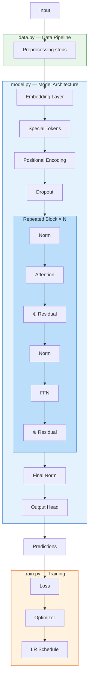

# DL Model Architecture Diagram — Agent Template

> **Purpose:** This template guides an AI agent to produce a publication-quality system diagram for any deep learning project in this repository, following the style of Sebastian Raschka's model-gallery diagrams (e.g., Gemma 4, LLaMA 3, Phi-3).

---

## Step 1 — Research the Codebase (MANDATORY)

Before generating any diagram, the agent **MUST** read every source file and extract:

| What to Extract | Where to Look |
|---|---|
| **Model classes** (layers, blocks, full model) | `model.py` or equivalent |
| **Config dataclass** (all hyperparameters + defaults) | `config.py`, `config.yaml` |
| **Data pipeline** (datasets, transforms, splits) | `data.py` |
| **Training loop** (optimizer, scheduler, loss, grad clip) | `train.py` |
| **Evaluation** (metrics, inference) | `evaluate.py` |
| **Visualization utilities** | `visualize.py`, `attention_viz.py` |
| **Shared utilities** (checkpointing, LR schedule, seed) | `shared/` directory |
| **Baseline model** (if any) | `baseline.py` |
| **Tests** | `tests/` directory |

> [!CAUTION]
> **Never hallucinate dimensions, layer names, or hyperparameters.** Every value in the diagram must be traced to a specific line in the code.

---

## Step 2 — Fill the Architecture Inventory

After reading the code, populate this inventory. Every field must have a code reference:

```yaml
project_name: ""           # e.g., "VisionTX"
model_class: ""            # e.g., "ViT"
paper_reference: ""        # e.g., "Dosovitskiy et al., 2020"

# ─── Input ───
input_shape: ""            # e.g., "(B, 3, 32, 32)"
dataset: ""                # e.g., "CIFAR-10"
n_classes: 0
preprocessing:
  - ""                     # e.g., "RandomHorizontalFlip"
  - ""                     # e.g., "Normalize(μ, σ)"

# ─── Embedding Layer ───
embedding_type: ""         # e.g., "PatchEmbedding via Conv2d"
embedding_details: ""      # e.g., "kernel=4×4, stride=4"
embedding_output: ""       # e.g., "(B, 64, 128)"

# ─── Special Tokens / Positional Encoding ───
special_tokens: ""         # e.g., "[CLS] token prepended"
positional_encoding: ""    # e.g., "Learned 1D positional embeddings"
sequence_length: 0         # e.g., 65

# ─── Core Repeated Block ───
block_name: ""             # e.g., "ViTEncoderBlock"
n_layers: 0                # e.g., 6
block_components:
  - name: ""               # e.g., "Pre-LayerNorm 1"
    type: ""               # "norm", "attention", "ffn", "residual", "dropout"
  - name: ""
    type: ""

# ─── Attention Mechanism ───
attention_type: ""         # e.g., "Multi-Head Self-Attention (bidirectional)"
n_heads: 0
d_model: 0
d_head: 0                  # d_model / n_heads
projection_bias: true      # true/false
scale_factor: ""           # e.g., "√d_head"

# ─── Feed-Forward Network ───
ffn_structure: ""          # e.g., "Linear → GELU → Linear → Dropout"
d_ff: 0                    # intermediate dimension
activation: ""             # e.g., "GELU"

# ─── Output Head ───
head_type: ""              # e.g., "Linear classifier on [CLS] token"
head_input_dim: 0
head_output_dim: 0         # n_classes

# ─── Training Config ───
optimizer: ""
learning_rate: 0.0
weight_decay: 0.0
lr_schedule: ""            # e.g., "Cosine with linear warmup"
warmup_epochs: 0
max_epochs: 0
batch_size: 0
grad_clip: 0.0
loss_function: ""          # e.g., "CrossEntropyLoss"

# ─── Metrics & Evaluation ───
primary_metric: ""         # e.g., "Top-1 Accuracy"

# ─── Parameter Count ───
total_params: ""           # e.g., "~1.8M"

# ─── Baseline (if any) ───
baseline_name: ""          # e.g., "SmallResNet"
baseline_params: ""        # e.g., "~11.2M"
```

---

## Step 3 — Generate the Diagram

### 3A. Generated Image (via `generate_image`)

Use this prompt template, filling `{placeholders}` from the inventory:

```
A professional deep learning architecture system diagram for {project_name},
in the style of Sebastian Raschka's model gallery diagrams. Clean white
background, structured vertical layout.

MAIN FLOW (center, bottom to top):
1. "{dataset} Input {input_shape}" — white rounded box
2. "{embedding_type}" — blue box showing: {embedding_details}, output: {embedding_output}
3. "{special_tokens}" — gray box
4. "{positional_encoding}" — gray box
5. Large blue container "{block_name} × {n_layers}" containing:
   {block_components listed with arrows and ⊕ for residuals}
6. "Final {norm_type}" — white box
7. "{head_type}" — white box
8. "Class Predictions ({n_classes} classes)" — green box

LEFT ANNOTATIONS (blue text): {all hyperparameters from config}
RIGHT DETAIL BOXES (dotted outlines): expanded views of attention and FFN

Style: monochrome + blue accents, rounded rectangles, ⊕ for residuals,
dotted boxes for detail views. Title: "{project_name} — {model_class} Architecture"
```

### 3B. Mermaid Diagram (for README.md)

Use this Mermaid template structure:



### 3C. Code-Mapping Table

Always include a table mapping diagram components to source files:

```markdown
| Diagram Component | Source File | Class / Function |
|---|---|---|
| ... | ... | ... |
```

### 3D. Interactive HTML Diagram (optional)

Generate an HTML file at `docs/architecture_diagram.html` with:
- Left panel: hyperparameter annotations
- Center: vertical flowchart with styled boxes and arrows
- Right panel: expanded detail views (attention, FFN)
- Bottom: code-mapping table

---

## Step 4 — Embed in README

Insert the following block into the project's `README.md` under `## Architecture`:

```markdown
### System Diagram


> **Interactive HTML version:** [`docs/architecture_diagram.html`](docs/architecture_diagram.html)

#### Data Flow — Forward Pass

{mermaid diagram here}

#### Code → Component Mapping

{code mapping table here}
```

---

## Step 5 — Verification Checklist

Before finalizing, the agent must verify:

- [ ] Every dimension in the diagram matches a `config.py` value or `forward()` shape
- [ ] Every layer name matches an `nn.Module` class or attribute in the code
- [ ] The number of repeated blocks matches `config.n_layers`
- [ ] All hyperparameters (lr, wd, dropout, etc.) match `config.yaml`
- [ ] The data flow order matches the actual `forward()` method execution
- [ ] The code-mapping table references correct line numbers
- [ ] The diagram image file exists at the referenced path
- [ ] The README renders correctly on GitHub (Mermaid supported)

---

## Style Guidelines

| Aspect | Rule |
|---|---|
| **Colors** | Main flow: blue (#4285f4). Data: green (#2e7d32). Training: orange (#e65100). Output: green (#34a853) |
| **Shapes** | Rounded rectangles for layers. Circles with ⊕ for residual adds. Dashed boxes for detail views |
| **Annotations** | Left side: model config. Right side: expanded sub-modules |
| **Typography** | Inter or system sans-serif. Bold for component names, italic for tensor shapes |
| **Arrows** | Solid for data flow. Dashed for skip/residual connections |
| **Subgraph nesting** | Data pipeline → Model → Repeated block (nested). Training loop separate |

---

## Example Projects

| Project | Model | Key Blocks | Status |
|---|---|---|---|
| `visiontx/` | Vision Transformer (ViT) | PatchEmbed → Encoder×6 → CLS Head | ✅ Done |
| `pretrain/` | GPT-style LM | TokenEmbed → Decoder×N → LM Head | ⬜ Pending |
| `finetune/` | Fine-tuned LM | Frozen base + LoRA/Head | ⬜ Pending |
| `backprop/` | MLP from scratch | Linear×N + manual gradients | ⬜ Pending |
